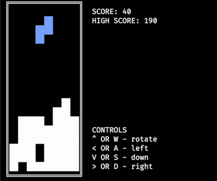
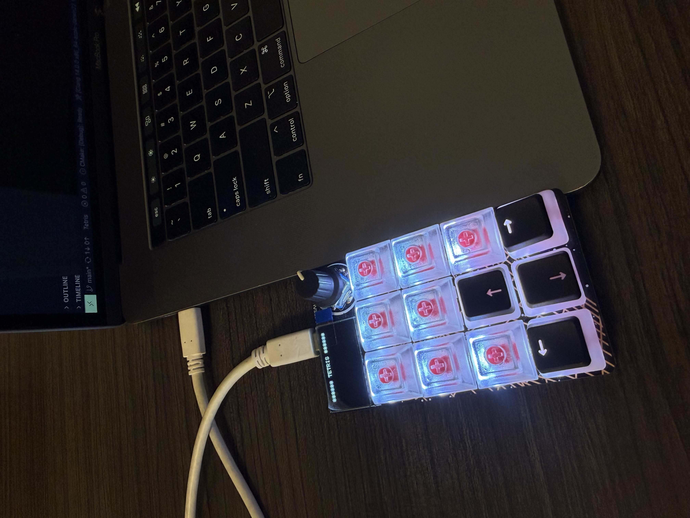

# Detris - a tetris inspired game!

Runs in the terminal. Arrow keys or WASD to play, four board sizes, high scores saved locally.



## The controller



Nine hot-swap switches and a knob on an RP2040 (from Adafruit). Firmware is in `macos/microcontroller/`.

[Full demo video](rp2040%20controller.mov) (~30s)

## Building

macOS / Linux - needs ncurses:

```
cmake -S . -B build && cmake --build build
./build/macos/main
```

There's a separate Windows version in `windows/`.
